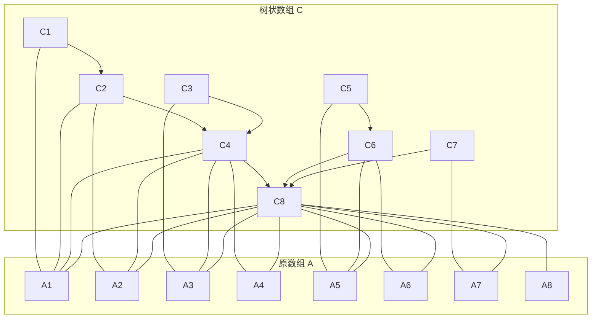

好的，这是一份简单易懂的树状数组（Binary Indexed Tree, BIT）讲义，希望能帮助你理解这个高效的数据结构。

---

### 树状数组（Fenwick Tree）讲义

#### 1. 什么是树状数组？

树状数组，又称作“二叉索引树”（Binary Indexed Tree）或“Fenwick树”，是一种巧妙的数据结构，它可以在对数时间复杂度内（$O(\log n)$）完成对数组的**单点更新**和**区间查询**。

**核心思想：**

*   **高效性**：相比于普通数组$O(n)$的区间求和与线段树复杂的实现，树状数组在代码复杂度和运行效率上取得了很好的平衡。
*   **前缀和思想**：它的查询操作是基于前缀和的思想，即[l, r]区间的和可以通过 `query(r) - query(l-1)` 来计算。

简单来说，如果你需要频繁地更新数组中某个元素的值，并快速地查询某个区间的总和，树状数组是一个非常优秀的选择。

#### 2. 核心原理

树状数组的精髓在于它利用了整数的二进制表示。它通过一个辅助数组 `c[]` 来维护原数组 `a[]` 的信息。`c[x]` 存储的是原数组 `a` 中一个特定区间的和，这个区间的长度由一个叫做 `lowbit` 的函数决定。

##### 2.1 `lowbit` 函数

`lowbit(x)` 函数返回的是 `x` 的二进制表示中，最低位的 `1` 以及它后面的所有 `0` 组成的数。

例如：
*   `x = 6` 的二进制是 `110`，最低位的 `1` 在第二位，所以 `lowbit(6)` 的结果是 `10`（二进制），即 `2`。
*   `x = 8` 的二进制是 `1000`，最低位的 `1` 在第四位，所以 `lowbit(8)` 的结果是 `1000`（二进制），即 `8`。

**`lowbit` 的计算方法：**

在计算机中，我们可以通过一个非常巧妙的位运算来快速计算 `lowbit(x)`：

$$
lowbit(x) = x \& (-x)
$$

这个公式利用了计算机中负数的补码表示。

##### 2.2 树状结构

树状数组虽然名叫“树”，但它的物理存储结构依然是一个**数组**。它的树状逻辑结构是通过 `lowbit` 函数来建立的。

*   `c[x]` 节点所管辖的区间是 `[x - lowbit(x) + 1, x]`，长度为 `lowbit(x)`。
*   `c[x]` 的父节点是 `c[x + lowbit(x)]` (当 `x + lowbit(x) <= n` 时)。

我们可以用 `mermaid` 语法来形象地表示这个结构：



从图中可以看出：
*   `C[1]` 管辖 `A[1]`
*   `C[2]` 管辖 `A[1]` 到 `A[2]`
*   `C[4]` 管辖 `A[1]` 到 `A[4]`
*   `C[8]` 管辖 `A[1]` 到 `A[8]`

#### 3. 核心操作

树状数组主要支持两个核心操作：单点更新和区间查询。

##### 3.1 单点更新 (`add`)

当我们要更新原数组 `a[x]` 的值时（比如增加 `k`），我们需要更新所有管辖到 `a[x]` 的 `c` 数组中的节点。根据我们之前定义的父子关系，我们只需要不断地向上更新父节点即可。

**更新路径：** `x`, `x + lowbit(x)`, `x + lowbit(x) + lowbit(x + lowbit(x))`, ... 直到超出数组范围。

$$
add(x, k): \text{ for i = x to n, i += lowbit(i), do c[i] += k}
$$

**示例代码 (Python):**
```python
def add(x, k):
  while x <= n:
    c[x] += k
    x += lowbit(x)
```

##### 3.2 区间查询 (`query`)

当我们要查询 `a[1]` 到 `a[x]` 的前缀和时，我们可以将这个区间拆分成多个由 `c` 数组维护的小区间的和。

**查询路径：** `x`, `x - lowbit(x)`, `x - lowbit(x) - lowbit(x - lowbit(x))`, ... 直到 `x` 变为 0。

$$
query(x): \text{ sum = 0; for i = x to 1, i -= lowbit(i), do sum += c[i]}
$$

**示例代码 (Python):**
```python
def query(x):
  sum = 0
  while x > 0:
    sum += c[x]
    x -= lowbit(x)
  return sum```

**查询任意区间 `[l, r]` 的和:**
利用前缀和思想，`sum(l, r) = query(r) - query(l - 1)`。

#### 4. 应用场景

树状数组的应用非常广泛，主要包括：

*   **动态维护区间和**：这是最基本也是最常见的应用。
*   **维护区间最值**：稍作修改，树状数组也可以用来维护单点修改情况下的区间最值（如最大值或最小值）。
*   **计算逆序对**：在一个序列中，如果 `i < j` 且 `a[i] > a[j]`，则 `(a[i], a[j])` 是一个逆序对。树状数组可以高效地统计逆序对的数量。
*   **二维树状数组**：可以扩展到二维，用于处理矩阵中的单点更新和子矩阵查询。

#### 5. 完整代码示例 (Python)

下面是一个完整的树状数组实现，用于解决“单点更新，区间求和”的问题。

```python
class FenwickTree:
    def __init__(self, size):
        self.n = size
        self.c = [0] * (size + 1)  # 树状数组下标从1开始

    def lowbit(self, x):
        return x & (-x)

    def add(self, x, k):
        """在位置 x 增加 k"""
        while x <= self.n:
            self.c[x] += k
            x += self.lowbit(x)

    def query(self, x):
        """查询前缀和 [1, x]"""
        sum_val = 0
        while x > 0:
            sum_val += self.c[x]
            x -= self.lowbit(x)
        return sum_val

    def query_range(self, left, right):
        """查询区间和 [left, right]"""
        if left > right:
            return 0
        return self.query(right) - self.query(left - 1)

# 使用示例
if __name__ == '__main__':
    data = [1, 2, 3, 4, 5, 6, 7, 8]
    n = len(data)
    
    ft = FenwickTree(n)
    
    # 初始化树状数组
    for i, val in enumerate(data):
        ft.add(i + 1, val)
        
    # 查询区间 [3, 7] 的和 (3+4+5+6+7)
    print(f"区间 [3, 7] 的和是: {ft.query_range(3, 7)}")

    # 将 a[4] 的值增加 10 (原值为4，变为14)
    ft.add(4, 10)

    # 再次查询区间 [3, 7] 的和 (3+14+5+6+7)
    print(f"更新后区间 [3, 7] 的和是: {ft.query_range(3, 7)}")```

#### 6. 总结

*   **优点**：代码实现简洁，常数小，时间复杂度优秀（$O(\log n)$）。
*   **缺点**：能解决的问题范围相对线段树较窄，主要适用于满足结合律且可差分的操作（如加法、异或），对于求最值等操作需要特殊处理。

希望这份讲义能够帮助你掌握树状数组！